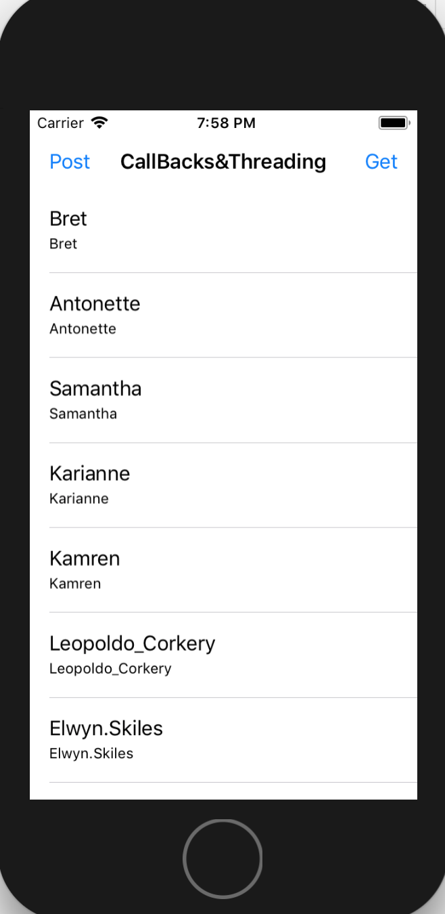

# UrlSessionCallBacksThreading
This project use UrlSession to present data that is read in from a json txt file to a tableView. To make Things simple I added a Completion block so we can callback. The table view have two navigation bar button that reads "Post" and "Get". Both buttons use https://jsonplaceholder.typicode.com/ as an end point.

